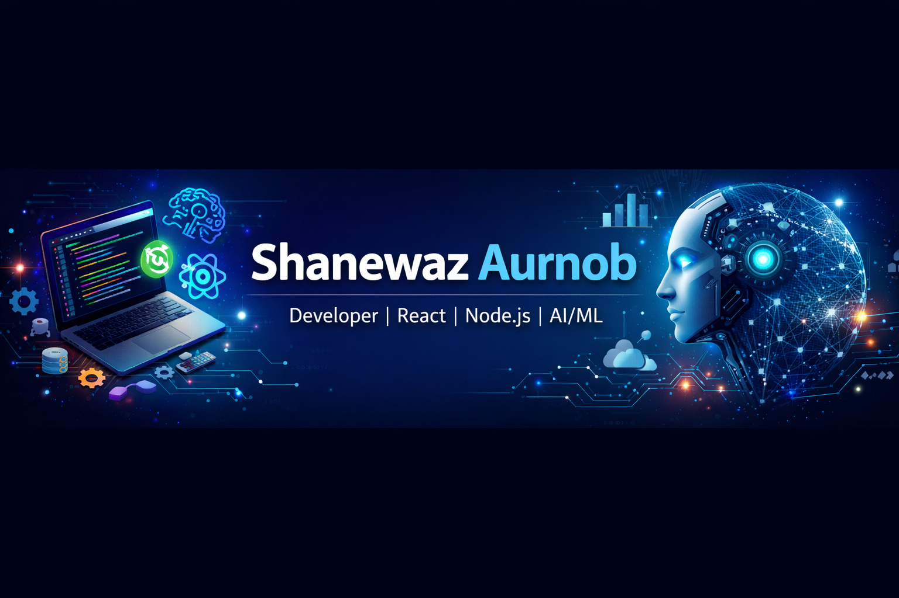

<!--
**ShanewazAurnob/ShanewazAurnob** is a ✨ _special_ ✨ repository because its `README.md` appears on your GitHub profile.
-->

<h1 align="center">Hello! 👋</h1>
<h3 align="center">I'm **Shanewaz Aurnob**

🎓 **Computer Science & Engineering Graduate** — University of Chittagong  
🤖 **AI & NLP Researcher** | 💻 **Software Engineer**

---

## 🚀 About Me
I build **web & mobile applications** with a touch of **AI/ML**.  
I love learning new tech, collaborating on projects, and solving real-world problems with clean, efficient code.  

- 🎯 **Current Focus:** AI/ML mini-projects  
- 🌱 **Learning:** Next.js, TypeScript, TensorFlow.js  
- 💡 **Passions:** Full-stack development, AI, Open-source contributions  
- ⚡ **Fun Fact:** I turn coffee ☕ into code 💻  

---

## 🛠️ My Toolbox

**Languages:**  
 
 
 
 
  

**Frontend:**  
 
 
 
 
  

**Backend & BaaS:**  
 
 
  

**Databases:**  
 
  

**Mobile App:**  
  

**Design Tools:**  
  

---

## 📫 Let's Connect
- ✉️ **Email:** shanewaz.aurnob@gmail.com  
- 🔗 **LinkedIn:** [linkedin.com/in/shanewazaurnob](https://linkedin.com/in/shanewazaurnob)  
- 🌐 **Portfolio:** [shanewazaurnob.com](https://shanewazaurnob.com)  
- 🐦 **Twitter:** [@shanewaz_aurnob](https://twitter.com/shanewaz_aurnob)  

---

**“Code is like humor. When you have to explain it, it’s bad.” – Cory House**
